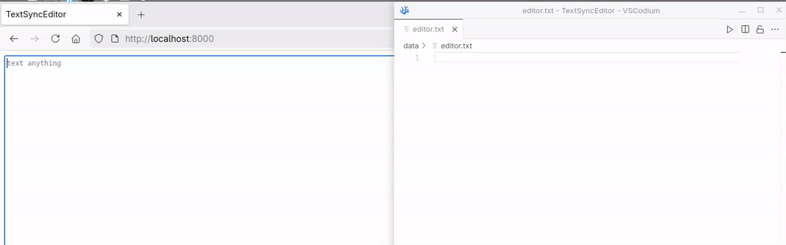

# TextSyncEditor

> Real-time text editor that automatically saves to local files using WebSocket

## 📋 Description
TextSyncEditor is a web-based text editor inspired by VSCode that allows you to write code or text directly in your browser while automatically saving changes to your local file system in real-time. Built with FastAPI and WebSocket technology for seamless synchronization between browser and local storage.

## ✨ Features
- [x] Real-time auto-save to local files
- [x] Web-based text editing interface
- [x] WebSocket-powered instant synchronization
- [x] Browser-based editing experience
- [x] Automatic file persistence
- [x] Simple and lightweight design

## 🖼️ GIF


## 🛠️ Technologies Used
- **Backend:** Python, FastAPI
- **Real-time Communication:** WebSocket
- **Frontend:** HTML, CSS, JavaScript
- **Text Editor:**: Plain textarea

## Installation

### Prerequisites
- Python 3.8 or higher
- uv (Python package manager)

### Steps

1. **Clone the repository**
```bash
git clone https://github.com/Shiva-Adhikari/TextSyncEditor.git
cd TextSyncEditor
```

2. **Install dependencies**
```bash
uv sync
```

3. **Run the application**
```bash
uv run python -m uvicorn src.main:app --reload
```

4. **Open in browser**
```bash
https://localhost:8000
```

### 🚀 Usage
1. Open the application in your web browser
2. Start typing in the area
3. Your text will automatically save to the local file in real-time
4. Changes are synchronized instantly via WebSocket
5. Close and reopen - your data persists!

**Default save location:** `data/editor.txt` (configurable)

## 📁 Project Structure
```bash
TextSyncEditor/
├── data
│    └── editor.txt
├── screencasts
│    └── demo.mp4
├── src
│    ├── index.html
│    ├── index.js
│    └── main.py
├── .gitignore
├── .python-version
├── pyproject.toml
├── README.md
└── uv.lock
```

### ⚙️ Configuration
You can modify the following settings in `main.py`
- **Port number:** Change the port in `uvicorn.run()` or in `("ws://localhost:8000/ws")` (default:8000)
- **Save file path:** Modify the file path variable (default: `data/editor.txt`)
- **Auto-save interval:** Adjust WebSocket message frequency (default: real-time)

### 🔧 How it Works
1. **Frontend:** User types in textarea
2. **WebSocket:** Sends text data to server instantly
3. **Backend:** FastAPI receives data via WebSocket
4. **File System:** Saves content to local file
5. **Persistence:** Data remains even after browser close

### 📄 License
This project is licensed under the MIT License - see the [LICENSE](LICENSE) file for details.

### 👤 Author
- GitHub: [@Shiva-Adhikari](https://github.com/ShivaAdhikari)
- Project Link: [https://github.com/ShivaAdhikari/TextSyncEditor](https://github.com/ShivaAdhikari/TextSyncEditor)

### 🙏 Acknowledgements
- Inspired by VSCode's editing experience
- Built with ❤️ using FastAPI and WebSocket and diff_match_patch
- Thanks to the Python and FastAPI community

---

Made with 💻 by Shiva Adhikari
